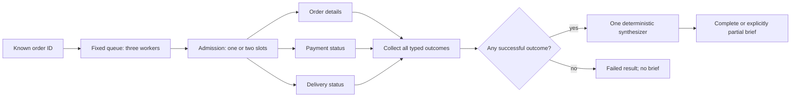

# M3 Bounded Fan-Out and Fan-In Design

- **Date:** 2026-10-05
- **Status:** Accepted by the owner on 2026-10-05; implementation plan review pending
- **Milestone:** M3 — Parallel fan-out and fan-in
- **Project:** BoundRelay
- **Baseline:** merged M2 at `497132e827d27dc81048fab9fcb7e8de809e2bda`
- **Decision:** [D-014](../../decisions/D-014-m3-bounded-read-only-fanout-fanin.md), accepted
- **Depends on:** [foundation design](../../design/2026-09-02-foundation-design.md), D-001 through D-013, completed M0/M1/M2 verification

## 1. Purpose and design brief

M3 teaches independent work, bounded execution, explicit partial failure, and deterministic synthesis. The owner requested careful continuation along the existing roadmap after M2 integration. The roadmap requires independent read-only workers, bounded concurrency, explicit partial failure, a deterministic merge contract, and one synthesizer owning the final write.

This accepted design preserves offline execution, TypeScript/Python parity, lesson-local implementations, shared behavioral contracts, and exact-revision evidence. The owner approved the written scenario and policy choices on 2026-10-05. Product implementation requires review of the detailed plan and selection of its execution method.

The teaching objective is:

> Independent reads may overlap, but the orchestrator still owns admission, validation, failure accounting, and the synthesis boundary. Completion order must not choose the report's content or hide missing evidence.

M3 adds deterministic asynchronous workers, not model-backed agents. Fixed worker selection and mechanical synthesis require no LLM judgment. This follows D-006's scripted decision-provider option and the foundation's code-controlled orchestration rule. It must explain when sequential calls are sufficient and when bounded fan-out is useful, without claiming measured production speedup.

## 2. Approaches considered

| Approach | Benefit | Limit | Choice |
|---|---|---|---|
| Fixed read-only workers with sequential and bounded parallel modes | Isolates admission, fan-in, failure, and merge behavior; offline evidence is repeatable | Does not teach dynamic decomposition or provider behavior | Recommended |
| Sequential reads only | Small deterministic baseline | Cannot demonstrate overlapping independent execution | Keep as baseline, not the milestone |
| Model-selected workers with model-backed synthesis | Can teach decomposition and interpretation | Adds provider, budget, topology, and output-policy decisions before concurrency is proved | Defer |

### Teaching sequence

Follow D-005: establish the known-identifier problem, build sequential reads, justify overlapping independent work, show an isolated naive example, inject controlled failures, correct admission/collection/synthesis, and prove the invariants. The naive example launches all three reads without a cap and appends directly to a shared brief in completion order. A deterministic gated demonstration exposes its three active calls and completion-order-dependent report. Keep this example in the lesson walkthrough/exercise and its small regression demonstration, not as another public CLI mode or canonical case. The corrected runtime retains the two-slot limit, typed outcomes, canonical merge order, and one publisher. Explain why neither version needs model judgment and when three sequential calls are the better choice.

## 3. Canonical scenario: order brief

The scenario ID is `order-brief`. Its input is a known order identifier, initially `ORD-1001`. It requests an internal structured brief, not a customer message or an external write.

M1's order investigation required one observation to identify a subsequent read. M3 deliberately starts with the identifier already known: its three reads do not depend on each other's results. The new lesson does not call the M1 tool loop or M2 router.

The fixed worker and synthesis order is:

1. `order-details`;
2. `payment-status`;
3. `delivery-status`.

Each worker receives only an independent immutable/copy-isolated `{order_id}` input. It cannot access sibling outputs, the shared report, or the event sink. The orchestrator wraps each invocation and owns lifecycle events. The worker directory has exactly these three entries, with no runtime registration or model-selected topology.

Canonical successful records are deliberately small:

| Worker | Validated output for the canonical order |
|---|---|
| `order-details` | `{order_id: ORD-1001, order_status: SHIPPED}` |
| `payment-status` | `{order_id: ORD-1001, payment_status: PAID}` |
| `delivery-status` | `{order_id: ORD-1001, delivery_status: DELAYED}` |

The lesson uses independent fixture snapshots. It does not claim live consistency between external services, infer a delay cause, or send a customer response.

## 4. Execution modes and admission

The CLI has `--mode sequential|parallel`, `--case`, and `--trace`. A case defines exactly one allowed mode. Unknown, missing, positional, duplicate, or case-incompatible arguments are tooling errors.

- `sequential`: execute the same three workers in canonical order with limit `1`.
- `parallel`: admit workers in canonical order with limit `2`.

The limit is fixed by mode, not a model response or configurable fixture value. A worker retains its slot until its outcome has been validated and recorded. On a declared worker failure, release the slot and continue admitting the remaining workers. Never invoke a worker twice, retry it, create an unbounded set of tasks, or replace a failed worker with a sibling.

The scheduler must launch genuinely asynchronous work. Calling each worker to completion before admitting the next is not a parallel implementation, even if its trace claims two starts.

The diagram shows three queued jobs; parallel mode has two slots, not three simultaneous admissions.

## 5. Worker outcome boundary

Every ordinary worker outcome contains `worker_id`, `status`, `output`, and `failure_code`. The orchestrator supplies the identity; a provider cannot select another worker or overwrite a sibling's result.

| Worker status | Output | Failure code |
|---|---|---|
| `SUCCEEDED` | Strict worker-specific output | `null` |
| `FAILED` | `null` | `WORKER_EXECUTION_FAILED` or `INVALID_WORKER_OUTPUT` |

Worker outputs are closed objects with the exact fields above, matching the requested order ID. The field domains are `order_status: PROCESSING|SHIPPED|CANCELLED`, `payment_status: PAID|UNPAID`, and `delivery_status: PENDING|IN_TRANSIT|DELIVERED|DELAYED`. Order IDs follow `^ORD-[0-9]{4}$`. Reject missing or extra fields, wrong identifiers, unsupported statuses, and values that cannot safely cross the finite JSON boundary before public event serialization.

The scripted adapter can raise a declared worker execution failure. That becomes `WORKER_EXECUTION_FAILED`. A returned but invalid payload becomes `INVALID_WORKER_OUTPUT`. Neither supplies facts to synthesis. Public failure events contain only safe identifiers and the fixed failure code; raw rejected payloads, arbitrary exception text, prompts, and private reasoning are not trace data.

An unexpected implementation exception is a tooling failure, not an ordinary worker outcome. Stop new admissions, drain already-started finite scripted work, flush inspectable trace data, and propagate the exception to the CLI as exit `2` without a canonical success/partial result. Tests must prove it is not silently relabeled `PARTIAL` or `ALL_WORKERS_FAILED`.

## 6. Fan-in and the single synthesis boundary

For canonical executions, collect exactly one outcome for every fixed worker before synthesis. A duplicate, missing, unknown, or mismatched worker identity cannot be silently overwritten in a dictionary or accepted as complete fan-in.

The synthesizer receives the three validated outcomes in canonical worker order, including explicit failed outcomes. It has no access to raw invalid payloads. The resulting brief contains:

- the requested `order_id`;
- `sections`, containing successful worker outputs in canonical worker order, each identified by `worker_id`;
- `missing_workers`, containing failed worker IDs in canonical worker order;
- `complete`, true exactly when no worker is missing.

No default payment or delivery status is invented when a worker fails. Completion order cannot decide section order, completeness, or missing-worker order. Reversing any feasible completion schedule with the same outcomes produces the same brief.

The synthesizer is called exactly once when at least one worker succeeds, and never when all three fail. It is the only business-output publisher. Here the final write means publishing the returned brief into the run result; CLI result/trace serialization remains infrastructure. No database, file-backed business record, email, payment, or other external side effect is introduced.

## 7. Run result and partial-failure policy

The policy retains usable successful reads while marking missing evidence explicitly:

| Successful workers | Run status | Brief | Synthesis invoked | Run failure code |
|---|---|---|---|---|
| 3 | `SUCCEEDED` | Complete, three sections | `true` | `null` |
| 1 or 2 | `PARTIAL` | Incomplete, only successful sections | `true` | `null` |
| 0 | `FAILED` | `null` | `false` | `ALL_WORKERS_FAILED` |

`PARTIAL` is not interchangeable with `SUCCEEDED`. The result retains all three worker outcomes and their individual failure codes. The owner approved this policy with the written design.

The result also records schema version `1.0`, run/scenario/case IDs, `execution_mode`, `concurrency_limit`, `peak_concurrency`, requested order ID, synthesis invocation flag, and trace path. `peak_concurrency` must agree with reconstructed lifecycle evidence; it does not independently prove real overlapping calls.

Canonical domain results, including `PARTIAL` and `FAILED`, produce exactly one JSON stdout line and CLI exit `0`, preserving the earlier lessons' distinction between domain outcomes and tooling errors. Exit `2` denotes tooling/configuration errors.

## 8. Scripted scheduling and canonical cases

The fixture provider has finite per-worker outcomes and a mode-compatible completion order. It releases an outcome only after that worker has actually entered its invocation. It uses explicit async gates/acknowledgements, not random delays, arbitrary sleeps, or elapsed-time thresholds.

Validate the complete trajectory before dispatch: the worker set must be exact, identities unique, each outcome consumed once, and the release order feasible under canonical admission and the case's fixed slot limit. In particular, never wait for all three workers to start behind a two-slot gate. Fixture/configuration errors are tooling failures.

Fixture grammar validates the return/failure operators and schedule, not whether a returned business payload will pass the worker schema. The invalid-output case must reach runtime validation. The release controller advances only after acknowledgement of the recorded worker terminal, not merely when a provider future resolves; this makes the completion-order witness repeatable across runtimes without requiring identical cross-worker start interleavings.

The milestone contains exactly six cases:

| Case ID | Mode | Completion order | Expected outcome |
|---|---|---|---|
| `sequential-complete` | sequential | order, payment, delivery | `SUCCEEDED`, complete brief, peak 1 |
| `parallel-complete` | parallel | order, payment, delivery | Same business brief, peak 2 |
| `parallel-out-of-order` | parallel | payment, delivery, order | Same business brief, peak 2 |
| `parallel-partial-failure` | parallel | order, payment, delivery | Delivery execution failure; `PARTIAL`, delivery missing |
| `parallel-all-failed` | parallel | order, payment, delivery | Three execution failures; `FAILED`, no synthesis |
| `parallel-invalid-output` | parallel | order, payment, delivery | Payment returns unsupported status; `PARTIAL`, payment missing |

The abbreviated order/payment/delivery labels denote the fixed full worker IDs. The out-of-order case releases payment first, admits delivery into its freed slot, releases delivery, and finally releases order. Both initial workers must enter before the first parallel outcome is released.

Additional unit tests cover two simultaneous failures, invalid inputs/outputs, extra/private fields, wrong order IDs, non-finite/cyclic values, mutation isolation, duplicate outcomes, malformed trajectories, and unexpected exceptions. They are not extra milestone parity cases.

## 9. Trace contract

Keep the shared event envelope and its enum unchanged at version `1.0`. M3 reuses `run.created`, `run.started`, `step.started`, `step.completed`, `step.failed`, `run.completed`, and `run.failed`.

Worker step names are `worker.order-details`, `worker.payment-status`, and `worker.delivery-status`. The synthesis step is `synthesize`. M3 payload validation is scenario-specific because the shared envelope only requires an object-valued `data` field.

- Run creation/start bind the order, case, execution mode, and concurrency limit.
- A worker start binds `step_name`, `worker_id`, and order ID.
- A successful worker completion carries its validated typed outcome.
- A failed worker step carries its fixed typed outcome with null output.
- Synthesis start carries the canonical validated outcome list; synthesis completion carries the exact brief.
- `run.completed` is used for `SUCCEEDED` and `PARTIAL`, with the actual status and corresponding result fields retained.
- `run.failed` is used for canonical `ALL_WORKERS_FAILED`.

There is exactly one terminal run event, after all three canonical worker terminals and any synthesis events. A completed run event alone must never be interpreted as proof of full success. No model events are required or invented.

## 10. Validation, normalization, and parity

Validate raw traces before comparing them: strict JSONL, schema-valid envelopes/payloads, contiguous global sequences, unique event IDs, stable run ID/source, exact case/mode/order binding, exactly one start and terminal per worker, no terminal before its start, slot bounds reconstructed from active identities, complete fan-in before synthesis, and exact result/terminal/report binding.

Do not reuse M2's one-entry-per-event-type lookup: repeated worker step types must be grouped by fixed step/worker identity only after duplicates and missing transitions have been checked.

Two comparison relations are distinct:

1. **Same case/mode across languages:** compare normalized run results, every validated worker lifecycle, observed canonical completion order, and synthesis/run lifecycle. Parallel cross-worker interleavings may differ; M3 may project them into per-worker ordered lifecycles after raw validation. Remove global `sequence` only from those independently grouped worker records in this scenario-specific semantic projection. Preserve worker identity, step name/type, order, payload, failure code, lifecycle count, mode, limit, peak, completion-order witness, and all synthesis/terminal behavior. Keep the raw sequence checks and trace artifacts.
2. **Sequential versus parallel, or changed feasible completion order:** compare an explicitly defined business projection of order ID, run status/failure code, all canonical worker outcomes, synthesis invocation, and brief. Mode, case ID, limit, peak, generated metadata, and scheduling events differ and are not part of this business comparison.

Do not change the global normalizer to sort all events or discard worker/result business fields. Mutation tests must reject an extra/missing worker event, swapped worker identity, wrong mode/limit, impossible completion order, false peak, lost failure, incorrect brief, early synthesis, or false complete status before a projection could hide it.

## 11. Proving actual concurrency and ownership

The authority must run tests with instrumented worker bodies independent of the runtime's reported counters. The probe records entry, exit, input snapshots, active invocations, per-worker invocation count, and synthesis calls.

- Sequential mode never has more than one active worker body.
- Parallel mode never has more than two, and a gated test proves two worker bodies are simultaneously entered before either can finish.
- The queued third worker cannot enter while both slots are occupied.
- Releasing payment allows delivery to enter while order remains active.
- Every canonical worker is called exactly once, including declared failures and malformed returns.
- The synthesizer starts only after every worker settles, receives canonical typed outcomes, and is invoked once or zero times according to the status table.
- Completion-order changes preserve the business brief; failed reads never contribute invented facts.

A bounded test watchdog may detect a deadlock, but is test infrastructure rather than a new runtime timeout/recovery feature. No speedup claim or noisy duration comparison is an acceptance criterion. Trace self-report cannot substitute for these probes.

## 12. Planned artifacts and architecture

The future implementation is lesson-local and idiomatic in each language:

- `lessons/03-parallel-fanout-fanin/{typescript,python}/`: scenario loading, scripted worker provider, fixed worker directory, bounded scheduler, collector, deterministic synthesizer, trace sink, runner, CLI, and tests;
- `lessons/03-parallel-fanout-fanin/{README.md,invariants.yaml}`;
- `fixtures/scenarios/order-brief.yaml` and dedicated scripted worker/failure fixtures;
- `contracts/workers/order-brief-worker-result.schema.json`;
- `contracts/results/order-brief-result.schema.json`;
- `tools/contracts/test_m3_contracts.py`;
- `tools/parity/{verify_m3.py,test_m3_verification_safety.py}`;
- `scripts/verify_m3.py` and `.github/workflows/m3.yml`.

Contract and fixture implementation must wait for design and implementation-plan approval. No generic worker framework, shared scheduler extraction, new package family, or edits to M0/M1/M2 business rules are required.

## 13. Verification authority and evidence

The future documented authority is `python scripts/verify_m3.py`. It captures a clean starting revision before invoking `python scripts/verify_m2.py`, which already owns the M1/M0 regression chain. Do not directly rerun each lower milestone a second time.

The gate must run shared contract/fixture checks, TypeScript typecheck/tests, Python tests, independent invocation/concurrency/ownership probes, offline/import guards, verifier-safety mutation tests, all six paired CLI cases, same-mode semantic parity, and business-projection comparisons. Lower evidence must also match the starting revision and PASSED status.

Before any gate step, remove stale M3 evidence. Publish `.boundrelay/m3/verification-evidence.json` only after all checks pass and final clean-worktree/unchanged-HEAD checks succeed. Preserve verification semantics under optimized Python; no correctness check may depend on removable `assert` statements.

Evidence records the exact revision, command, runtime versions, requested case/mode/language executions, six case records, twelve raw trace paths, validated outcome/report data, and successful independent concurrency/ownership test execution. Local and CI use the same command. CI checks out the exact candidate commit and uploads `m3-verification-<revision>` including hidden evidence files.

## 14. Invariants and completion criteria

1. Exactly the three fixed workers are admitted, in canonical queue order.
2. Each canonical worker is invoked exactly once with isolated minimum input.
3. Sequential concurrency is bounded by one.
4. Parallel concurrency is bounded by two and independently proved to overlap.
5. No queued worker enters while all slots are occupied.
6. Exactly one typed outcome is retained per worker; identity cannot be overwritten.
7. Invalid outputs never enter synthesis or public traces as raw values.
8. Declared failures preserve usable sibling outcomes without retry.
9. Unexpected implementation exceptions remain tooling failures.
10. All canonical worker outcomes settle before synthesis starts.
11. Synthesis is invoked once with at least one success and zero times with none.
12. Sections and missing workers follow canonical order, independent of completion order.
13. Missing evidence is explicit and never fabricated.
14. Full, partial, and all-failed statuses follow the exact success-count table.
15. Workers cannot publish or mutate the shared brief.
16. Raw lifecycle/slot checks precede any semantic normalization.
17. Exactly one canonical terminal event agrees with the result and brief.
18. Same-mode TypeScript/Python semantics and cross-mode business projections match.
19. All six canonical cases run offline, with strict schema-valid outputs and traces.
20. M0/M1/M2 remain valid and all evidence is bound to the current candidate revision.

M3 is complete only when executable evidence proves all these requirements for the candidate revision. This accepted design and a passing lower-milestone gate do not establish M3 completion.

## 15. Explicit exclusions

M3 does not introduce real providers, model-backed workers/synthesis, dynamic decomposition, dynamic worker registration, retries, runtime deadlines/cancellation, persistence, checkpoints, recovery, cross-service consistency, external business writes, approval/idempotency workflows, Go, MCP, framework mappings, or a reusable multi-agent runtime. These remain separate later decisions. Lesson-local async execution and test watchdogs do not implement M4 recovery or M5 side-effect semantics.

## 16. Written-design review gate

The owner approved this written design and D-014 on 2026-10-05, covering the order-brief scenario, fixed worker topology, limits, partial-result policy, single synthesis owner, six canonical cases, failure taxonomy, trace/parity boundaries, and revision-bound authority.

The [implementation plan](../plans/2026-10-05-m3-bounded-fanout-fanin.md) is the next review artifact. Review that plan and select its execution method before product implementation. Design acceptance alone does not authorize product code, schema, fixture, dependency, or workflow implementation.
